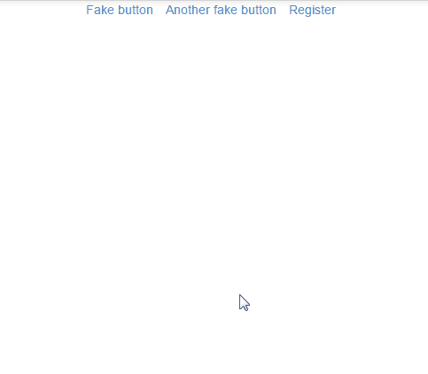
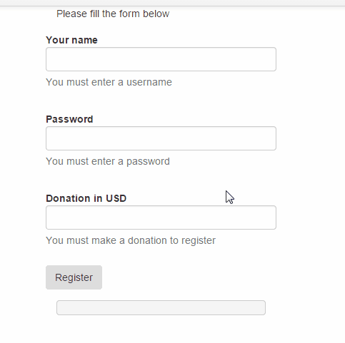

Recently a fellow developer from Varna, Krasimir Tsonev, posted <a href="http://krasimirtsonev.com/blog/article/unit-test-your-client-side-javascript-jsdom-nodejs">an article about Unit Testing client-side JavaScript</a>.
I have always enjoyed reading articles from fellow Bulgarian developers, but in this particular case, I felt there were a number of problems with the proposed approach.
In the following post I am going to point out some of these problems and discuss alternative approaches.
I will provide an implementation of the same basic functionality with less code, and then expand on it to illustrate best practices when working with AngularJS.

So, let me first show you a declarative implementation of Krasimir's form:



<a href="http://plnkr.co/edit/fY2rN5anm3AkbZksiPNN?p=preview">Live Example on Plunker</a>

```html
<header>
  <ul class="list-inline">
    <li><a href="#">Fake button</a></li>
    <li><a href="#">Another fake button</a></li>
    <li><a href="#" ng-click="form_visible=true">Register</a></li>
  </ul>
</header>

<form ng-show="form_visible" name="RegisterForm">
  Please fill the form below

  <label for="username">Your name</label>
  <input
    type="text"
    name="username"
    id="username"
    ng-model="user.username"
    ng-required="true"
    ng-minlength="10"
  />
  <div ng-messages="RegisterForm.username.$error">
    <span ng-message="required" class="help-block">
      You must enter a username
    </span>
    <span ng-message="minlength" class="help-block">
      Username must be at least 10 chars long
    </span>
  </div>

  <label for="username">Password</label>
  <input
    type="password"
    name="password"
    id="password"
    ng-model="user.password"
    ng-required="true"
    ng-minlength="6"
  />
  <div ng-messages="RegisterForm.password.$error">
    <span ng-message="required" class="help-block">
      You must enter a password
    </span>
    <span ng-message="minlength" class="help-block">
      Password is too short
    </span>
  </div>

  <button
    type="submit"
    ng-click="RegisterForm.$valid && register(user)"
    class="btn"
  >
    Register
  </button>
</form>
```

These 30 odd lines are the full implementation for that form.
A better user experience written in a third of the code, and not a single line of JavaScript.

How? By writing idiomatic AngularJS.

First, let's discuss Krasimir's `appHeader` directive.
That directive creates an unnecessary abstraction.
All it really does is hold some template code, and a few lines of JavaScript that we don't even need.
Directives should not be used as generic templating code containers.
Even less so when there's a chance our designer might need to work with that code.
If you really need to abstract that code away, put it in a separate template and load it with <a href="https://docs.angularjs.org/api/ng/directive/ngInclude">ngInclude</a>.
As for the JS part of that directive, it can be easily taken care of by <a href="https://docs.angularjs.org/api/ng/directive/ngShow">ngShow</a>/<a href="https://docs.angularjs.org/api/ng/directive/ngHide">ngHide</a>, as show in my example.

> But if I used HTML templates, wouldn't that execute additional HTTP requests?

Indeed, if you use `ng-include` AngluarJS will do an extra request to retrieve the HTML template.
However, since you're already using Angular, I am going to assume that you have some sort of build script, right?
<a href="https://github.com/karlgoldstein/grunt-html2js">grunt-html2js</a> is a Grunt module that will directly compile your HTML template files into cachable JavaScript.
You get to both work with simple HTML files (which your designer will thank you for) and you take no performance penalties.

Now, before we go any further, there's a point I need to make:

### Take care so you don't end up writing jQuery wrapped in AngularJS

AngularJS is a front-end framework, and you get numerous ways for manipulating the DOM out of the box.
For almost all common cases you can think of (and a few you probably can't) you can find an AngularJS directive that does the job.

But, if you ever come across a problem where you know you need to manipulate the DOM manually, you need to understand AnguarJS' digest cycle.

So, what is it?

AngularJS has a mechanism that ensures all its various pieces are in proper sync, and it depends on that to keep a consistent application state.
A `$scope.$digest()` is automatically triggered in response to user actions, browser events, callbacks and many more.
It makes sure that the DOM and the application state (eg, variables you have on `$scope`) stay consistent.
There are various types of binding between DOM and AngularJS state, but most of the time you will have a two-way data binding.
That means that whenever a variable changes on one side it must change on the other.

However, every time you do direct DOM manipulation with a third party library (e.g. jQuery), you're introducing a change that Angular does not know about.
While some changes are benign (like changing CSS properties), others can introduce subtle and hard to track down bugs.
I'd go as far as to say that not understanding the `$digest` cycle is the source of most bugs novices experience when dealing with AngularJS.

That and not using objects when binding on `$scope`. Seriously:

```js
// always this:
$scope.user = {
  username: "",
  password: "",
}

// never this:
$scope.username = ""
$scope.password = ""

// Because JavaScript can track changes made to an object,
// but cannot track changes to a primitive variable, like a string.
```

So, doing a manual DOM manipulation runs the risk of introducing a change to the application that AngularJS is not aware of, and desync the actual state of the application from Angular's knowledege.

How do we fix that?

You can do your manipulations inside a <a href="https://docs.angularjs.org/api/ng/type/$rootScope.Scope#$apply">$scope.$apply(callback)</a> function, and that's the preferred approach.
You could also call <a href="https://docs.angularjs.org/api/ng/type/$rootScope.Scope#$digest">$scope.$digest()</a> manually after you finish making your manipulations, but this is not advisable.

If you want to dive deeper into the concepts behind this, I recommend reading the chapters on Data Binding and Scopes in the <a href="https://docs.angularjs.org/guide">AngularJS Developer Guide</a>.

Use <a href="https://docs.angularjs.org/api/ng/service/$http">\$http</a> instead of `jQuery.ajax`, <a href="https://docs.angularjs.org/api/ng/service/$timeout">\$timeout</a> instead of `timeout` and <a href="https://docs.angularjs.org/api/ng/directive/ngClick">ngClick</a> instead of `jQuery.on('click')`.
All of these are tied into AngularJS' execution cycle and `$scope.$apply()` is automatically called for you.
Keep this in mind every time you feel the urge to write some jQuery code in your Angular app.

<h3>And now, let's go through our rewrite, step by step</h3>

We can rewrite the whole `AppHeader` directive from Krasimir's original code in just 2 attributes:

```html
<header>
  <ul class="list-inline">
    <li><a href="#">Fake button</a></li>
    <li><a href="#">Another fake button</a></li>
    <li><a href="#" ng-click="form_visible=true">Register</a></li>
  </ul>
</header>

<form ng-show="form_visible">
  [...]
</form>
```

AngularJS allows us to assign dynamic attributes on the current scope directly in HTML, and check their value in real time.
`ng-click` takes an expression that is evaluated as if it was normal JavaScript, with respect to the current scope.
So, we set the `form_visible` variable to `true` when the Register link is clicked, which triggers the <a href="https://docs.angularjs.org/api/ng/directive/ngShow">`ng-show`</a> directive and makes the form visible.

<h5>Next, validation.</h5>

When writing validation, you <strong>should never</strong> write the separate parts as a series of `if {} else if {} else if..` statements.
This results in an very poor user experience where you make the users submit the form over and over again just to see error after error.
On submit, we should present all errors at once.
And with Angular we can do even better and show them dynamically as the user is typing

Oh, and we can also handle all of the necessary validations with built in Angular directives.
No need to write any custom JavaScript:

```html
<form name="RegisterForm">
  <p>Please fill the form below</p>

  <label for="username">Your name</label>
  <input
    type="text"
    name="username"
    id="username"
    ng-model="user.username"
    ng-required="true"
    ng-minlength="10"
  />

  <label for="username">Password</label><br />
  <input
    type="password"
    name="password"
    id="password"
    ng-model="user.password"
    ng-required="true"
    ng-minlength="6"
  />

  <button
    type="submit"
    value="register"
    id="register-button"
    class="btn"
    ng-disabled="RegisterForm.$invalid"
    ng-click="register()"
  >
    Register
  </button>
</form>
```

To make a field required all we need is an <a href="https://docs.angularjs.org/api/ng/input/input%5Btext%5D">`ng-required="true"`</a> attribute.
In the same way we can just add <a href="https://docs.angularjs.org/api/ng/input/input%5Btext%5D">`ng-minlength="10"`</a> attribute to force length validation
Both these checks come ready-to-use with <a href="https://docs.angularjs.org/api/ng/input/input%5Btext%5D">`input[text]`</a> in AngularJS.

Additionally, we give a name to the form, which creates an instance of <a href="https://docs.angularjs.org/api/ng/type/form.FormController">form.FormController</a> with the same name.
We can use it to check the validity of all fields within a form with the `$valid` and `$invalid` properties.

Finally, we disable the submit button until the form has been made valid.

Now, while the above implementation is easy and it does validate the form, it's a terrible user experience.
At the very least, should <em>tell</em> the user what the errors are.

Enter <a href="https://docs.angularjs.org/api/ngMessages/directive/ngMessages">ngMessages</a> and the first usable example of the form:

<a href="http://plnkr.co/edit/3Bj5FLh2fjYIFPpdo079?p=preview">Live example on Plunker</a>

```html
<form name="RegisterForm">
  <p>Please fill the form below</p>
  <label for="username">Your name</label><br />
  <input
    type="text"
    name="username"
    id="username"
    ng-model="user.username"
    ng-required="true"
    ng-minlength="10"
  />
  <div ng-messages="RegisterForm.username.$error">
    <span ng-message="required" class="help-block">
      You must enter a username
    </span>
    <span ng-message="minlength" class="help-block">
      Username must be at least 10 chars long
    </span>
  </div>

  <label for="username">Password</label><br />
  <input
    type="password"
    name="password"
    id="password"
    ng-model="user.password"
    ng-required="true"
    ng-minlength="6"
  />
  <div ng-messages="RegisterForm.password.$error">
    <span ng-message="required" class="help-block">
      You must enter a password
    </span>
    <span ng-message="minlength" class="help-block">
      Password is too short</span
    >
  </div>

  <button
    type="submit"
    value="register"
    ng-click="register()"
    id="register-button"
    class="btn"
    ng-disabled="RegisterForm.$invalid"
  >
    Register
  </button>
</form>
```

Lastly, Angular will add some classes on the form element and on the input element to show the validity state of the fields.
Angular automatically adds the class `ng-invalid` to an `&lt;input&gt;` if any of the validations fail.
In our form, the fields will initially have the classes `ng-invalid ng-invalid-required ng-invalid-minlength`.
Once all validation constraints are satisfied, the class changes to `ng-valid`.
Also, it's worth noting that the `user` object won't get changed until all validations are satisfied.

Using `FormController` we can get access to the <a href="https://docs.angularjs.org/api/ng/type/ngModel.NgModelController">ngModelController</a> for a particular field, and use its `$error` property that keeps an array of validation errors that looks something like:

```js
{
  "$error": {
       "minlength": true
  }
}
```

In vanilla AngularJS, you will have only one error for the field, the most recent error from the ngModel validators stack (we're gonna talk more about what that is later).
Some 3rd party directives may change this behavior and have multiple errors in this property, but this is not a problem for us.
We're using the newly introduced <a href="https://docs.angularjs.org/api/ngMessages/directive/ngMessages">ngMessages</a> module, part of Angualr 1.3.
`ngMessages` can parse `ngModel.$error` and allows us to specify error messages in a straightforward and easy to read format.
Additionally, if you have errors that commonly show up in your forms (like `required` or `numeric`) you can move those to a separate, reusable template, and just define the ones specific to the current field.

And if you're stuck on pre 1.3 Angular, here is a simple hack to get a similar effect:

<!-- prettier-ignore-start -->
```html
<span class="help-block" ng-repeat="(error, _) in RegisterForm.password.$error">{{
  {
    "required": "You must enter a password",
    "minlength": "Password is too short",
  }[error] || error
}}</span>
```
<!-- prettier-ignore-end -->

#### And there you have it, a full implementation of the original form in just a few lines of declarative HTML, and no JavaScript at all.

Good job, us!

> But... Where did all unit tests go? Wasn't the original article about unit tests?

Young padawan, look back to that original article and search your feelings.

> There were never any unit tests to begin with, ...were there?

<iframe width="880" height="496" src="//www.youtube.com/embed/GhMvKv4GX5U" frameborder="0" allowfullscreen=""></iframe>

Indeed, the tests presented in that article are anything but unit.
I hesitate to even call them integration tests, because they're such an amalgamation of unrelated contexts and bad use of AngularJS.
But, even if we ignore the fact that you don't need jsdom (jQuery's document fragment compilation will do the same job in most cases, but in Angular we actually have \$compile), and you don't need a controller, and you should never run your tests by instantiating a full AngularJS app…

No, ignore all that.
The one thing that cannot be ignored is `setTimeout(runTests, 1000);`
That means that the single test in that article takes <em>TAKES ONE SECOND TO RUN</em>!
This is utterly unacceptable!

What happens if you write a bunch of tests in this fashion?<br>
<a href="http://plnkr.co/edit/uzdQYwI1S0uktOjTDBeG?p=preview">THIS.</a>

Every single test takes one second to run, and that is terrifying.
To compare and contrast, here is the time needed to run all tests for a real world project I recently worked on:

```
PhantomJS 1.9.7 (Linux): Executed 211 of 211 SUCCESS (0.416 secs / 0.437 secs)
```

That's right, 400 something <em>milliseconds</em>.<br>
It's the time it would take you to blink twice. If you can blink really really fast.

How much time would the same test suite take if I had written all my tests as shown in that article?
<em>Three and a half minutes for a single run.</em>

<br>

Don't do drugs, kids.

<br>

If you ever find yourself writing stuff like `setTimeout(runTests, 1000);` stop, take a deep breath, and try to figure out what went wrong.
AngularJS has many ways of controlling the state of the application and dealing with async callbacks.
In most cases, all you really need to do is call `$scope.$apply()` to get your models equalized with the DOM or `$timeout.flush()` to force all timers to execute synchronously.

You can see examples of proper unit testing at the end of this article.

<br>

#### OK, I think we're about done he-

> Hey, but what about custom validations? Ones that Angular doesn't know how to do?

#### ...I knew you were gonna ask that.

Frankly, AngularJS can handle almost any validation you can think of right out of the box, but sometimes we really do need something special.

So, let's write a validation directive!

We're going to say that our registration form has a required donation field, and the user must enter the amount they're willing to donate in order to register with our site.
Bear with me on this one, I was just looking for an easy example to illustrate.

So here is a custom directive for validating float input that allows up to two decimal places to be entered:

```js
.constant('FLOAT_REGEXP', /^\-?\d+\.?(\d{1,2})?$/)
.directive('adFloat', ['FLOAT_REGEXP', function(FLOAT_REGEXP) {
    return {
        restrict: 'A', // this directive should only be used as an attribute
        require: 'ngModel',
        link: function($scope, $element, attrs, ngModelCtrl) {
            // For DOM -> model validation
            ngModelCtrl.$parsers.push(function(viewValue) {
                if (ngModelCtrl.$isEmpty(viewValue)) {
                    ngModelCtrl.$setValidity('float', true);

                    return viewValue;
                }

                if (FLOAT_REGEXP.test(viewValue)) {
                    ngModelCtrl.$setValidity('float', true);

                    return parseFloat(viewValue).toFixed(2);
                } else {
                    ngModelCtrl.$setValidity('float', false);

                    return undefined;
                }
            });

            // For model -> DOM validation
            ngModelCtrl.$formatters.unshift(function(value) {
                if (!(ngModelCtrl.$isEmpty(value) || FLOAT_REGEXP.test(value))) {
                    ngModelCtrl.$setValidity('float', false);
                } else {
                    ngModelCtrl.$setValidity('float', true);
                }

                return value;
            });
        },
    };
}])
```

<p style="margin-top: 1.7rem">
And in our form:</p>

```html
<div class="form-group">
  <label for="donation" class="control-label">Donation in USD</label>
  <input
    type="number"
    name="donation"
    id="donation"
    class="form-control"
    ng-model="user.donation"
    ng-required="true"
    min="5"
    ad-float
  />
  <div
    ng-messages="RegisterForm['donation'].$error"
    ng-messages-multiple="false"
  >
    <span ng-message="required" class="help-block"
      >You must make a donation to register</span
    >
    <span ng-message="min" class="help-block"
      >Donations must be more than $5</span
    >
    <span ng-message="number" class="help-block"
      >Donation must be a valid dollar amount, like '13.37'</span
    >
    <span ng-message="float" class="help-block"
      >Donation must be a valid dollar amount, like '13.37'</span
    >
  </div>
</div>
```

> How about a directive that does some DOM manipulation?

#### Sure, we can do that.

Bootstrap will properly color form fields in red if we add a `.has-error` class to the `.form-group` element.
Let's write a directive that does that when it detects that a child element has AngularJS errors set.

This is based on <a href="http://blog.yodersolutions.com/bootstrap-form-validation-done-right-in-angularjs/?utm_source=github&amp;utm_medium=readme&amp;utm_campaign=code">a great post on handling validation in AngularJS</a> that I highly recommend reading.
Still, I found the <a href="https://github.com/paulyoder/angular-bootstrap-show-errors">proposed implementation</a> a bit too complicated for my needs and wrote a simpler version.
It also works better as a demonstration of the concept:

```js
.directive('showErrors', ['$timeout', function($timeout) {
    return {
        restrict: 'A',
        require:  '^form',
        link: function ($scope, $element, attrs, ngFormCtrl) {
            // This timeout is necessary to handle the case when we have
            // ng generated code inside of the show-errors element.

            // We want to allow interpolation of child elements, so we just
            // offset the attachment of the watchers until the browser renders
            // the next frame, by using a $timeout(func, 0, false); The false means
            // "don't trigger a digest cycle", because we don't change any variables
            $timeout(function() {
                // we search for a .form-control whose name attriubte is set
                var childInputName = $element[0].querySelector('.form-control[name]');
                    childInputName = childInputName && childInputName.getAttribute('name');

                if (!childInputName || angular.isUndefined(ngFormCtrl[childInputName])) {
                    // if we cannot find the expected element, throw an error and
                    // halt compilation
                    throw 'showError directive requires that you have a child `.form-control` element with a `name` attribute.';
                }

                // https://docs.angularjs.org/api/ng/type/$rootScope.Scope#$watch
                $scope.$watch(function() {
                    // on scope changes, check if the input's validation status has changed.
                    // additionally, if an input has not been touched or the form has not been
                    // yet submitted, consider the element valid
                    return ngFormCtrl[childInputName].$invalid
                        && (ngFormCtrl[childInputName].$touched || ngFormCtrl[childInputName].$dirty || ngFormCtrl.$submitted);
                }, function(is_invalid) {
                    $element.toggleClass('has-error', is_invalid);
                });
            }, 0, false);
        },
    };
}])
```

And the finished form:

<a href="http://plnkr.co/edit/ikVWnbQeMMTO4zjWexxc?p=preview">Live Plunker demo</a>



We now have a form that behaves even better.
When it loads initially, it looks like a normal form and we get the text about required fields.
Trying to submit the form will activate the `show-errors` directive and highlight fields that need the user's attention.

Note that these two directives solve generic problems and can be used in any form that needs them.
When possible, directives should be written in this manner.
Usually writing a directive that's used only one time is a bad practice.
Once again, try to weigh the value an abstraction adds to the cost of maintenance and the loss of locality in your code.

<blockquote>So, how do we test all this?</blockquote>

Now that we have some specific directives (e.g. `ad-float`) we can unit test them.
But the form itself?
In my opinion, the form as it is currently written, should not be tested.
We have turned all the JavaScript into a declarative template, and a single manual test while developing should be enough to make sure things are wired up correctly.
After all, the rule is "Only test code that you yourself have written."

If we were to test it, it would be best done as part of a full integration test.
That is to say, a test should drive through the entire registration chain, from start to finish.
Not deal with a single form.

As for the two directives we wrote, we can test those in real isolation.
We are going to use Jasmine and Angular Mocks.
Why Jasmine and not Mocha?
Because Angular has native bindings for Jasmine that means me writing less code.
You could test AngularJS with other testing frameworks, but it's not worth the hassle.

Leverage your framework. Be lazy. Write less code and you will have to maintain less code.

<a href="http://plnkr.co/edit/GDeYh5wZCJDpYCtNHOag?p=preview">Live tests for the adFloat directive</a>

```js
describe("adFloat", function() {
  var $scope, $compile, $timeout
  // load the Angular module that holds the directive
  beforeEach(module("myApp"))

  // use Angular's inject service to get a few services, and then assign them
  // to the local variables defined above
  beforeEach(inject(function(_$rootScope_, _$compile_, _$timeout_) {
    $scope = _$rootScope_.$new()
    $compile = _$compile_
    $timeout = _$timeout_
  }))

  // generic helper for compiling html
  function compile(html) {
    var elem, compiledElem

    elem = angular.element(html)
    compiledElem = $compile(elem)($scope)

    $timeout.flush() // force all timers that use the $timeout service to execute
    $scope.$digest() // execute Angular's digest cycle

    return compiledElem
  }

  // helper to compile the directive anew for each separate test
  function compileAdFloat() {
    return compile(
      [
        '<form name="TestForm">',
        '<input name="float_input" ng-model="float_val" ad-float />',
        "</form>",
      ].join("\n")
    )
  }

  it("should be valid when empty", function() {
    compileAdFloat()

    // we can check validity directly by accessing form controller -> model controller
    expect($scope.TestForm.float_input.$valid).toBe(true)
  })

  it("should be ng-invalid-float when given invalid value", function() {
    var html = compileAdFloat()
    $scope.TestForm.float_input.$setViewValue("ggbg") // set an invalid value
    $scope.$digest()

    expect($scope.TestForm.float_input.$valid).toBe(false)
    expect($scope.TestForm.float_input.$error["float"]).toBe(true)
    expect(html.find("input")[0].classList.contains("ng-invalid-float")).toBe(
      true
    )
  })

  it("should convert a string to a float number with 2 decimal places", function() {
    compileAdFloat()
    $scope.TestForm.float_input.$setViewValue("12.3") // set a valid value

    expect($scope.float_val).toBe("12.30")
  })
})
```

<a href="http://plnkr.co/edit/LzlcxTXwZNogwCznPdIE?p=preview">Live tests for the showErrors directive</a>

```js
describe("showErrors", function() {
  var $scope, $compile, $timeout
  // load the Angular module that holds the directive
  beforeEach(module("myApp"))

  // use Angular's inject service to get a few services, and then assign them
  // to the local variables defined above.
  beforeEach(inject(function(_$rootScope_, _$compile_, _$timeout_) {
    $scope = _$rootScope_.$new()
    $compile = _$compile_
    $timeout = _$timeout_
  }))

  // generic helper for compiling html
  function compile(html) {
    var elem, compiledElem

    elem = angular.element(html)
    compiledElem = $compile(elem)($scope)

    $timeout.flush() // force all timers that use the $timeout service to execute
    $scope.$digest() // execute Angular's digest cycle

    return compiledElem
  }

  // helper to compile the directive anew for each separate test
  function compileBetterErrors() {
    return compile(
      [
        '<form name="TestForm">',
        "<div show-errors>",
        '<input type="text" name="username" ng-model="username" ng-required=true class="form-control" />',
        "</div>",
        '<input type="submit" name="submit" value="submit" />',
        "</form>",
      ].join("\n")
    )
  }

  it("should not add the `has-error` class when the input has not been touched", function() {
    var html = compileBetterErrors()

    // we can check validity directly by accessing form controller -> model controller
    expect($scope.TestForm.username.$valid).toBe(false)
    expect(html.find("div")[0].classList.contains("has-error")).toBe(false)
  })

  it("should add the `has-error` class when the input has been touched", function() {
    var html = compileBetterErrors()
    html.find("input")[0].dispatchEvent(new Event("blur")) // trigger an event on the compiled html
    $scope.$digest() // and then execute the digest cycle

    expect($scope.TestForm.username.$valid).toBe(false)
    expect(html.find("div")[0].classList.contains("has-error")).toBe(true)
  })

  it("should add the `has-error` class when the form has been submitted", function() {
    var html = compileBetterErrors()
    $scope.TestForm.$setSubmitted(true)
    $scope.$digest()

    expect($scope.TestForm.username.$valid).toBe(false)
    expect(html.find("div")[0].classList.contains("has-error")).toBe(true)
  })

  it("should not add `has-error` class when the input is valid", function() {
    var html = compileBetterErrors()
    $scope.TestForm.username.$setViewValue("someUsername")
    $scope.TestForm.$setSubmitted(true)
    $scope.$digest()

    expect($scope.TestForm.username.$valid).toBe(true)
    expect(html.find("div")[0].classList.contains("has-error")).toBe(false)
  })

  it("should explode if no matching child element is found", function() {
    var bad_compilation = function() {
      compile(
        [
          "<div show-errors>",
          '<input type="text" name="username" ng-model="username" ng-required=true class="missing-form-control-class" />',
          "</div>",
        ].join("\n")
      )
    }
    expect(bad_compilation).toThrow()
  })
})
```

## Conclusion

Leverage your framework.
Do not write "jQuery wrapped in X", but take the time to learn idiomatic patterns.
And, when in doubt, consult people around you.
Learning new frameworks is hard, especially in the JS world where we seem to get a whole new toolchain every 8 months.
It's never a bad idea to have someone read over your code.

For additional reading about how to implement all sorts of JavaScript tests, I highly recommend <a href="http://jstesting.jcoglan.com/">James Coglan's JavaScript Testing Recipes</a>.
It shows practical ways to approach browser testing, server side testing and the testing of async functionality.
The recipes shown there are generic, and are not specifically tailored for AngularJS (which has good tooling around it already and provide stuff like `$timeout` and `$httpBackend`).
Never the less, it should prove a useful guide and reference to approaches for common testing woes.

Just, for the love of all that is holy, never write `setTimeout(runTests, 1000);`

</div>
